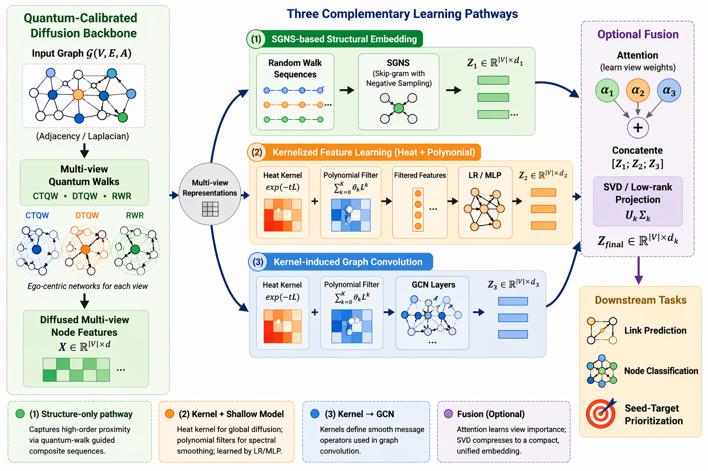

# QuVINE


<p align="center">
  <a href="./pyproject.toml"></a>
  <a href="./pyproject.toml">= 3.10" src="https://img.shields.io/badge/Python-%3E%3D%203.10-0b8ecf"></a>
  <a href="./pyproject.toml"></a>
  <a href="https://ibm.github.io/QuVINE/"></a>
</p>

QuVINE: Quantum-enhanced Multi-View Diffusion for Network Embeddings

<p align="center">
  
</p>


**QuVINE** is a framework for **Qu**antum and classical **V**iew-based **N**etwork **E**mbeddings. It supports graph preparation, complexity analysis, quantum and classical walk-based representation learning, embedding fusion, and downstream evaluation for biological and network-science workflows.

The project documentation is organized in a Sphinx website layout:
- Sphinx source files under `docs/source/`
- package API reference pages under `docs/api/`
- existing narrative guides under `docs/`
- hosted docs target: `https://ibm.github.io/QuVINE/`

## Documentation

### Sphinx website entry points
- **Hosted docs target**: `https://ibm.github.io/QuVINE/`
- **Sphinx source index**: [`docs/source/index.rst`](./docs/source/index.rst)
- **Documentation overview**: [`docs/README.md`](./docs/README.md)
- **API overview page**: [`docs/source/api_overview.rst`](./docs/source/api_overview.rst)

### Setup
- [`docs/setup/SETUP_INSTRUCTIONS.md`](./docs/setup/SETUP_INSTRUCTIONS.md)
- [`docs/setup/PYTHON_VERSION_GUIDE.md`](./docs/setup/PYTHON_VERSION_GUIDE.md)
- [`docs/setup/HPC_DEPLOYMENT.md`](./docs/setup/HPC_DEPLOYMENT.md)
- [`docs/setup/QBIOCODE_INSTALL.md`](./docs/setup/QBIOCODE_INSTALL.md)

### Guides
- [`docs/guides/QUICK_START.md`](./docs/guides/QUICK_START.md)
- [`docs/guides/COMPREHENSIVE_ANALYSIS_GUIDE.md`](./docs/guides/COMPREHENSIVE_ANALYSIS_GUIDE.md)
- [`docs/guides/COMPREHENSIVE_DATASET_GUIDE.md`](./docs/guides/COMPREHENSIVE_DATASET_GUIDE.md)
- [`docs/guides/PARALLELIZATION_GUIDE.md`](./docs/guides/PARALLELIZATION_GUIDE.md)
- [`docs/guides/QUANTUM_ADVANTAGE_AND_DOWNSTREAM_TASKS.md`](./docs/guides/QUANTUM_ADVANTAGE_AND_DOWNSTREAM_TASKS.md)

### API reference
- [`docs/api/quvine.rst`](./docs/api/quvine.rst)
- [`docs/api/pipeline.rst`](./docs/api/pipeline.rst)
- [`docs/api/complexity_pipeline.rst`](./docs/api/complexity_pipeline.rst)
- [`docs/api/data.rst`](./docs/api/data.rst)
- [`docs/api/complexity.rst`](./docs/api/complexity.rst)
- [`docs/api/embedding.rst`](./docs/api/embedding.rst)
- [`docs/api/baselines.rst`](./docs/api/baselines.rst)
- [`docs/api/evaluation.rst`](./docs/api/evaluation.rst)
- [`docs/api/fusion.rst`](./docs/api/fusion.rst)
- [`docs/api/views.rst`](./docs/api/views.rst)
- [`docs/api/walks.rst`](./docs/api/walks.rst)
- [`docs/api/utils.rst`](./docs/api/utils.rst)
- [`docs/api/analysis.rst`](./docs/api/analysis.rst)

### Development notes
- [`docs/development/CONTRIBUTING.md`](./docs/development/CONTRIBUTING.md)
- [`docs/development/IMPLEMENTATION_SUMMARY.md`](./docs/development/IMPLEMENTATION_SUMMARY.md)
- [`docs/development/IMPROVEMENTS_AND_FIXES.md`](./docs/development/IMPROVEMENTS_AND_FIXES.md)
- [`docs/development/BUG_REVIEW_AND_FIXES.md`](./docs/development/BUG_REVIEW_AND_FIXES.md)

## Package structure

```text
QuVINE/
├── configs/                 # experiment configuration files
├── data/                    # raw and processed datasets
├── docs/                    # narrative docs + Sphinx-style API docs
├── examples/                # runnable examples
├── notebooks/               # exploratory notebooks
├── scripts/                 # utility and batch execution scripts
├── src/quvine/              # package source code
│   ├── analysis/            # result analysis and comparison
│   ├── baselines/           # classical and hybrid baselines
│   ├── complexity/          # graph complexity metrics
│   ├── data/                # graph/data preparation utilities
│   ├── embedding/           # embedding and quantum filters
│   ├── evaluation/          # ranking/classification/link prediction
│   ├── fusion/              # embedding fusion
│   ├── utils/               # reusable utilities
│   ├── views/               # graph view generation
│   └── walks/               # classical and quantum walks
└── tests/                   # regression and integration tests
```

## Installation

```bash
git clone <repository-url>
cd QuVINE
pip install -e .
```

For environment-specific instructions, use the setup guides in [`docs/setup/`](./docs/setup/).

## Running QuVINE

CLI entry point:

```bash
quvine
```

Python entry point:

```python
from quvine.main import main
```

For complete workflows, start with:
- [`docs/guides/QUICK_START.md`](./docs/guides/QUICK_START.md)
- [`docs/guides/COMPREHENSIVE_ANALYSIS_GUIDE.md`](./docs/guides/COMPREHENSIVE_ANALYSIS_GUIDE.md)

## Core capabilities

- Graph preparation and preprocessing
- Complexity-aware graph analysis
- Quantum and classical walk pipelines
- Embedding generation and fusion
- Baseline model comparison
- Ranking, classification, and link prediction evaluation
- Large-scale and HPC-oriented experiment workflows

## Development status

Recent repository changes include:
- targeted bug fixes in graph complexity and GCN-MF utilities
- graceful optional-import handling for baseline and embedding packages
- Sphinx-style API reference pages under `docs/api/`
- QBioCode-style Sphinx website structure under `docs/source/`
- standard Sphinx build entry points via `docs/Makefile` and `docs/make.bat`

## Notes

- The README docs badge now targets the intended hosted documentation URL pattern: `https://ibm.github.io/QuVINE/`.
- A real documentation webpage requires building and publishing the Sphinx site from `docs/source/` (for example with GitHub Pages).
- The framework image currently used in the README is `./images/quvine_framework.png`.

## License

See [`LICENSE`](./LICENSE).